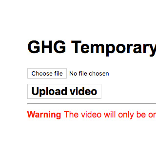
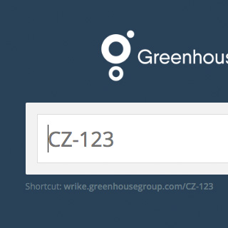

*Quick reference for all MEH tools out there!*

# [Edje](https://ch-edje.herokuapp.com/)

The MVP for a creative workflow platform, so we can easily send (dynamic) previews of creative material to clients and gather their feedback. It has a smooth integration with Wrike so it doesn’t feel like ‘yet another platform’.

# [Richifier](https://ghg-richifier-live.herokuapp.com/)

This will add the chosen rich media template to your LemonPI Studio creative zip, which makes it compatible to upload to Weborama.

# [Staticifier](https://ghg-staticifier-live.herokuapp.com/)

When using LemonPI to export creatives to a DSP is not an option, you can use the Staticifier to strip all Greenhouse Group related dependencies from a LemonPI Studio creative zip. This makes it suitable to deliver creatives to agencies that want to serve these without LemonPI.

# [Scalifier](https://ch-scalifier.herokuapp.com/)

The Scalifier allows for super-fast resizing of creatives. Even though it sounds like a minor task, it actually circumvents many mundane manual steps which quickly add up in hours.

# [DOOHifier](https://ch-doohifier.herokuapp.com/)

DOOHifier is a webapp for Creative Hub to make initialised LemonPI Studio-creatives for DOOH from the required screen specifications.

# [In-app Tester](https://meh-inapp-testing.herokuapp.com/add.html)

Makes in-app testing of LemonPI creatives flawless.

# [Creating a Contentful model for LemonPI](https://docs.google.com/document/d/1Vyn5wKO7TH-lTXwbSnN6HNNGjJHsFE5hFlch81AMkO4/edit)

This guide explains how you can create and configure a new Contentful model for usage with LemonPI (Smart LemonPI Pixel dynamic input).

# Template Campaign Laucher (TCL)

Coming soon!

# Manage Manager

Adds some improvements on top of LemonPI Manage, like cloning a dynamic input.

### How to use

To use the Manage Manager, you need to install [CJS for Chrome](https://chrome.google.com/webstore/detail/custom-javascript-for-web/poakhlngfciodnhlhhgnaaelnpjljija) first. Afterwards, visit manage.lemonpi.io and click the blue **cjs** button in the top right corner. Then paste the following script in the textarea:

```js
var e=document.createElement('script');e.src='https://cdn.greenhousegroup.com/ghg-nl/manage-manager/script.js',document.body.appendChild(e);
```

Press **save**.

Done!

# [Mobile Wall](https://bit.ly/bmiwall2)

Quickly open URLs on other devices by using the Mobile Wall.

# [Celtra-AppNexus parser](https://meh-celtra-appnexus-parser.herokuapp.com/)

For Unilever, the (huge amount) creatives have to be built in Celtra, but we want to run the creatives in AppNexus. Because there is no 1-to-1 integration, the specialist had to manually import the Celtra tags in AppNexus. We created an easy converter that changed a 2-hour job to a 2-minute job.

# [Temporary Uploader](https://ghg-temporary-uploader.herokuapp.com/)



<div style="width: 80%;">
  When using videos in display, you need a video URL while developing. The Temporary Uploader will do just that. (ask a MEHmber for the password)
</div>

# [Wrike ID redirect page](https://wrike.greenhousegroup.com/)



<div style="width: 80%;">
  Quickly open a Wrike task from a Wrike ID like "CZ-123".
</div>
